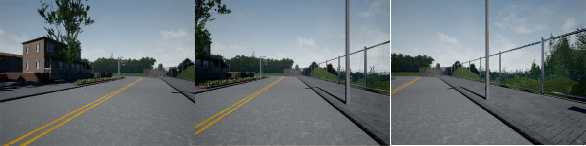
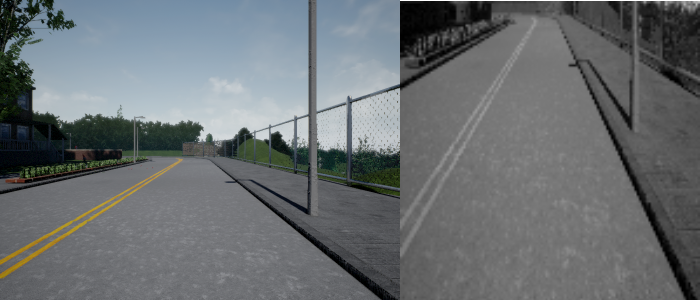
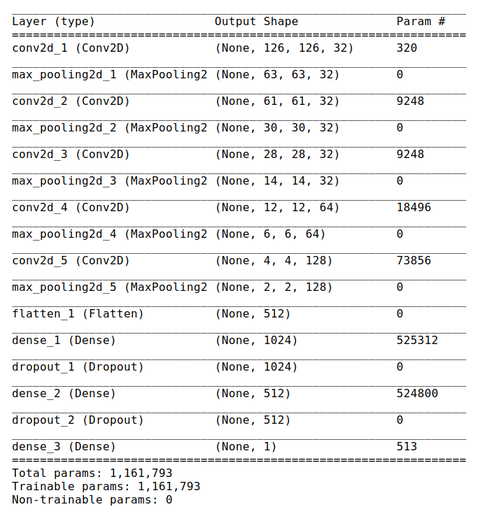
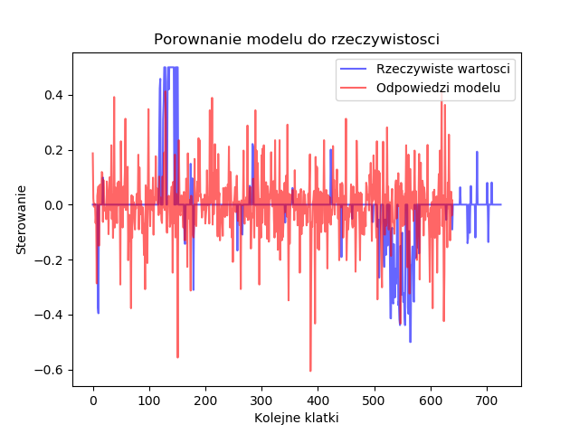

# Autonomous Driving

Ten projekt jest próbą stworzenia autonomicznego systemu do sterowania samochodem w symulowanym środowisku. Poligonem w tym przypadku jest symulator [Carla](http://www.carla.org), którego zasada działania opiera się na istnieniu serwera, który emuluje świat, a dostęp do niego jest przy użyciu python'owego klienta.

W obecnym momencie bardziej skupiam się nad stworzeniem wygodnego interfejsu i przydatnych narzędzi, które w przyszłości pozwolą mi lepiej rozwijać ten projekt. Sam model sterowania teraz nie odgrywa najważniejszej funkcji.

## Status

- [x] Dashboard
- [x] Rozbudowany klient z równoległymi procesami (wymagania usprawnienia)
- [x] System do zapisywania przejazdu
- [x] Skrypt do uczenia modelu i przetwarzania danych
- [x] Skrypt do porównywania modelu z rzeczywistym przejazdem
- [ ] Proces do autonomicznej jazdy w kliencie
- [ ] Rozpoznawanie obiektów

## Instalacja

System rozwijany jest pod Linux'em, a w szególność Manjaro. Nie był testowany na innych platformach

#### Wymagania
* Carla 0.7.1
* Python 3
* Keras
* Tensorflow GPU
* OpenCV 3.4.0
* Pygame
* całe requirements.txt

#### Pobranie
Pobieramy repozytorium i tworzymy wirtualne środowisko

```bash
$ git clone https://github.com/ATh0m/AutonomousDriving.git
$ cd AutonomousDriving
$ virtualenv --system-site-packages venv  
$ . venv/bin/activate
$ pip install -r requirements.txt
```

#### Instalacja Carla wraz z biblioteką do python'a

Symulator pobieramy z [GitHub](https://github.com/carla-simulator/carla/releases) i wypakowujemy do folderu **CARLA**. Następnie

```bash
$ cd CARLA/PythonClient
$ pip install -r requirements.txt
$ python setup.py install
```

## Uruchomienie

###### Serwer CARLA
```bash
./CarlaUE4.sh /Game/Maps/Town02 -carla-server -benchmark -fps=15 -windowed -ResX=800 -ResY=600
```

###### Dashboard z klientem
```bash
./main.py
```

###### Uczenie modelu
```bash
scripts/model.py [-h] [--load LOAD] [--save SAVE] [--validation VALIDATION] [--epochs EPOCHS] data
```

###### Porównanie sterowania
```bash
scripts/plot_steer.py [-h] --data DATA [--model MODEL]
```

## Dashboard


Jest to główny system do łączenia się z serwerem i gromadzena infromacji. Widoki z kamer można dostosowywać do przyjętego modelu. Największym problemem jest konieczność rozdzelenia obiowiązków pomiędzy wiele procesów, żeby osiagnąć jak najwyższą wydajność. Jest to obecnie zrobione dla połączenia z serwerem oraz zapisywania obrazów w trakcie nagrywania. Brakuje tego jeszcze dla przetwarzania wyświetlanych kamer. Dasgboard wyświetla dodatkowo informacje na temat ilości FPS, obecnej prędkości, kąta sterowania, przyspieszenia oraz statusu nagrywania.
Nagrywanie uruchamia się po przez wciśnięcie **R** na klawiaturze.

Kontrola samochodu odbywa się obecnie przy pomocy pada do Xboxa One. Prawa gałka odpowiada za przyspieszenie, a lewa za kąt sterowania. Jest to lepsze rozwiązanie, niż użycie wyłącznie klawiatury, ponieważ uzyskujemy wartości z ciągłego przedziału.

###### Struktura nagrania

Nagrania zapisywane są w folderze **data** i folderze z datą uruchomienia klienta. W katalogu **IMG** znajdują się zapisane obrazy z kamer, a w pliku **driving_log.csv** dane łączące obrazy z pozostałymi wartościami (w nagłówku są odpowiednie informacje).

## Model

Jak wspominałem wczesniej, w obecnym stanie projektu model nie jest jego najważniejsza częścią. Założenie jest takie, żeby model na podstawie wyłącznie widoku z przedniej kamery potrafił dobrać odpowiedni kąt sterowania.

### Pomysł

Do modelu samochodu zamontowane są 3 kamery RGB. Jedna patrzy centralnie na wprost, druga jest odchylona lekko w lewo, a trzecia w prawo. Dodatkowo zbierane są standardowe informacje tj. prędkość, kąt sterowania, przyspieszenie. Użytkownik wykonuje poprawny przejazd trasy (w moim przypadku było to objechanie mapy zewnętrzną drogą). Zakładając, że człowiek jeździ dobrze to chcemy nauczyć model podobnego zachowania. Posiadanie 3 kamer zwiększa nam znaczącą zakres danych uczących. Dla centralnej kamery mamy odpowiednie wartości, natomiast bocznym będziemy chcieli zmodyfikować trochę kąt. Jeśli model w przyszłości zobaczy taki obraz jak w lewej kamerze to znaczy, że trochę za bardzo zjechał w lewo i musi odbić w prawo (korekta wynosi 0.1).



Zestaw testowy został zebrany osobno i częsciowo jadąc w przeciwną stronę

### Preprocessing danych

* ucięcie górnej połowy
* przejście do skali szarości
* przeskalowanie do rozmiaru 128x128



## Struktura modelu



## Wyniki modelu

Sprawdziłem jak dla zbioru testowego wyglądają rzeczywiste kąty, a jak te przewidziane przez model



I nie wygląda to za ciekawie. Widać, że model nie radzi sobie z zakrętami. Jedyne z czym sobie może poradzić to jazda prosto. Jest to część nad którą należy popracować.

## Rozpoznawanie obiektów

Do tego zostanie wykorzystany model YOLO v2 oraz biblioteka darkflow
